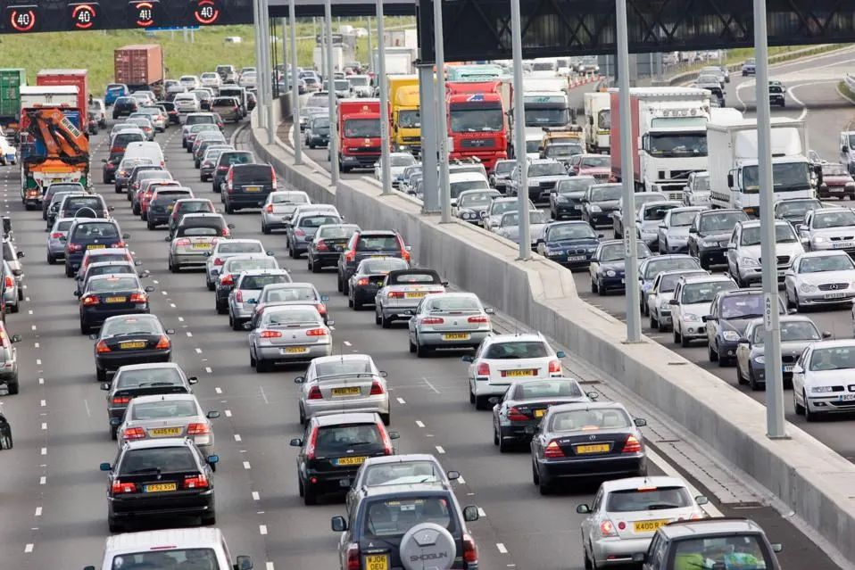
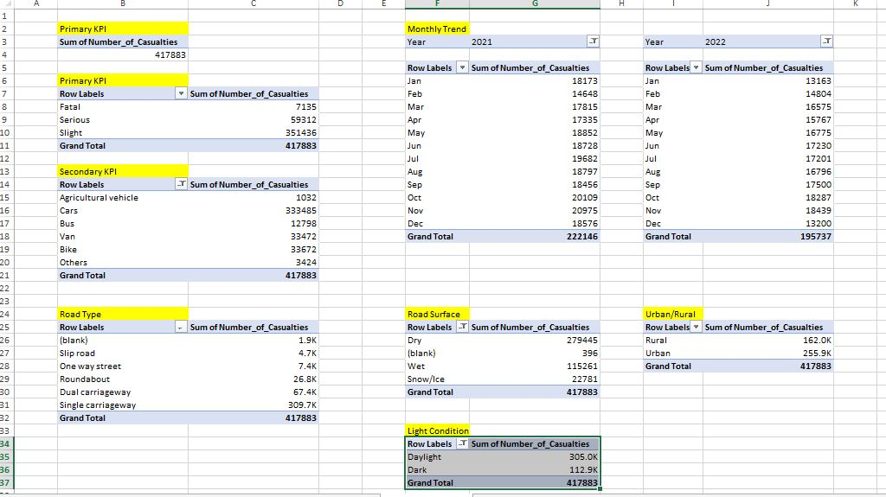
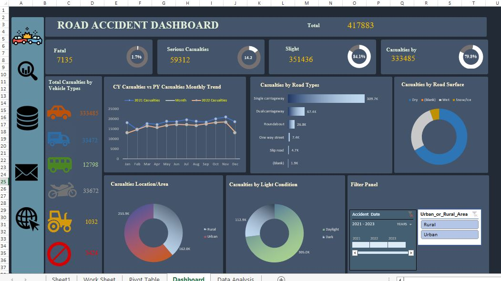
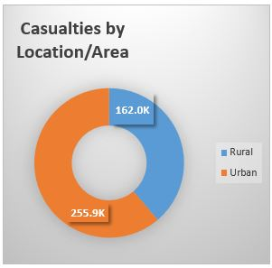
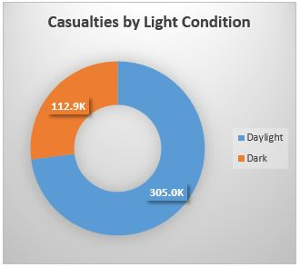
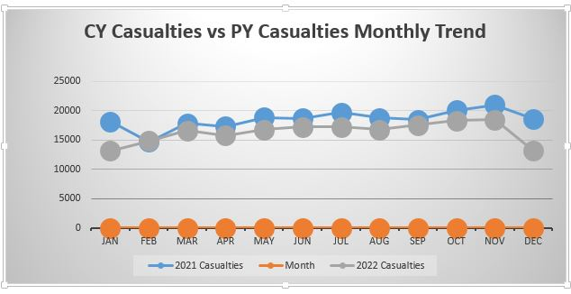

# Uk Road Accident Analysis for the Year 2021 and 2022

## Introduction
This is an Excel project on **UK road accident analysis for the year2021 and 2022.** This project is to analyze and derive insights to answer crucial questions and help make data driven decisions. 

**_Disclaimer_**: _I came across the dataset online and explore the richness of the dataset with respect to the statement problem. I have been trying to get my hands dirty with a rich dataset having specifics to practice my skills of data cleaning, analysis and visualization using the Microsoft Excel Software_.

## Problem statement

The clients want to create a road accident dashboard for year 2021 and 2022 so that they can have insight on the blow requirement.
1. Primary KPI: Total casualties taken place after the accident
2. Primary KPI: Total casualties and percentage of total with respect to the accident severity and maximum casualties by type of vehicle
3. Secondary KPI: Total casualties with respect to vehicle type, monthly trend showing comparison of casualties for current year and previous year, maximum casualties by road type, distribution of casualties by road surface, relation between casualties by area/location & by day/night.

## Data source
The data source was sourced from Google spreadsheet. This link to the data source is given below.
https://docs.google.com/spreadsheets/d/1R_uaoZL18nRbqC_MULVne90h3SdRbAyn/edit?usp=sharing&ouid=116890999875311477003&rtpof=true&sd=true

### Metadata 
- File Extension: .xlsx
- No of Rows: 307,974
- No of fields: 21
### Excel Concept Applied
The following Exploratory Data Analysis (EDA) was carried out:
- Data cleaning of the data 
- Extraction of key component to foster analysis
- Factoring out Key Performance Indicator (KPI) 
- Visualization of the KPI

## Data transformation/cleaning
Data was effectively transformed and cleaned in the Excel worksheet.
Data cleaning
- The column width size was adjusted to fit the cell data
- Filter was added to each column heading
- Each column heading was checked for empty or blank cell
- Correction of typo error- using find and replace (ctrl+f)
### Data processing
In data processing, there is a requirement that requires to show the trend line for the current year and the previous year casualties (monthly trend and yearly trend). The following steps was observed.
- Create new column and name the column.
- The “TEXT” function with the appropriate formula argument values was used to create data for the monthly and yearly trend.
- The new columns is checked for any blanks just to be safe.

## Data Modelling 
The pivot table was used to extract and connect related columns to form a mini table that correlate information from the datasheet and the problem statement requirement, from which the appropriate chart is derived showing the visualization of the said pivot table information.

## Data Visualization and Analysis

From the dashboard, the following was observed:
1.	Cars has the highest number of accident casualties (333485).
2.	Single carriageway has the highest occurrence accident casualties (309.7k).
3.	More accident occurs during the day (305.0k).
4.	Urban areas records the highest location of accident casualties (255.9k).
5.	Monthly and Yearly trend of accident casualties.

    

## Conclusion and Recommendation
### Result
The year 2021 in review shows the following result:
- Number of casualties by car: 177681
- Number of casualties by van: 17567
- Number of casualties by bus: 6225
- Number of casualties by bike: 18093
- Number of casualties by agricultural vehicles: 633
- Number of casualties by others: 1947
- Total number of casualties: 222146
- Percentage of car casualties: 80%

The year 2022 in review shows the following result
- Number of casualties by car: 155804
- Number of casualties by van: 15905
- Number of casualties by bus: 6573
- Number of casualties by bike: 15579
- Number of casualties by agricultural vehicles: 399
- Number of casualties by others: 1477
- Total number of casualties: 195737
- Percentage of car casualties: 79.6%

There was reduction in the total casualties by the end of the year 2022 which is about 6.3%. 

View the complete project [here](https://docs.google.com/spreadsheets/d/1LamXn1vcqAPxwxlzAIQg-PkEH4R1-NLG/edit?usp=drive_link)

---

